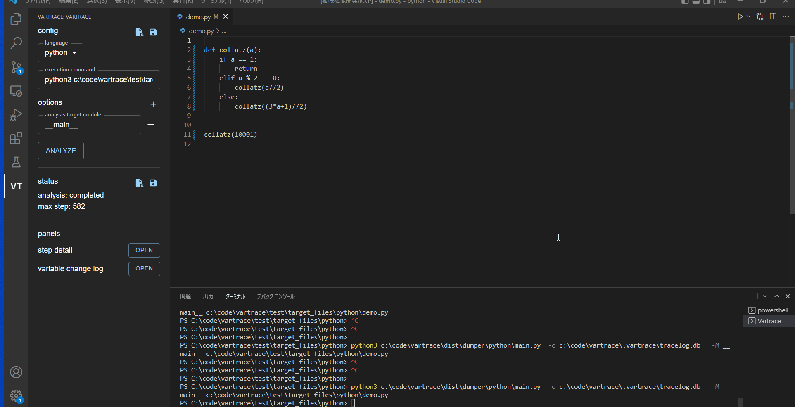
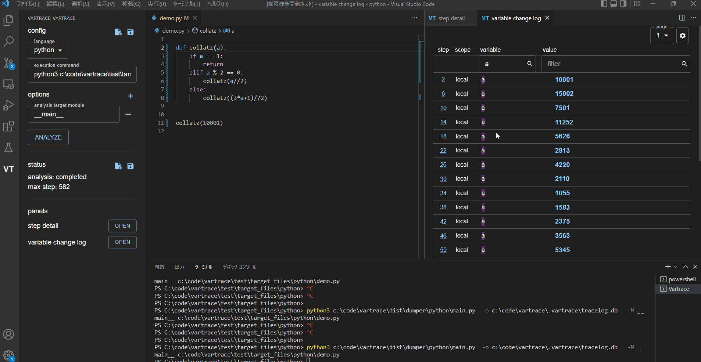
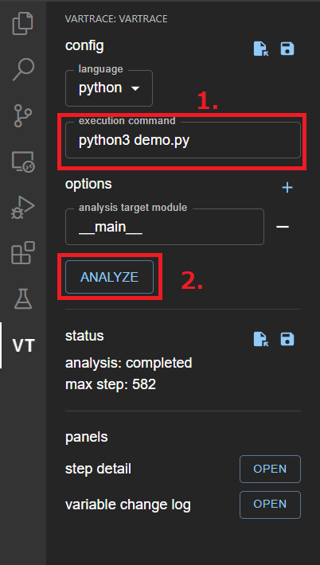

# VarTrace 
VarTrace is a debugger that records & analyze your script executions

## Features

* printf debug without modifing your code
  * search & filter by variable name or value

* step back, jump

## quick start
0. install this vscode extension. VT icon will appear the left of vscode
1. fill your execution command of sidebar
  * VarTrace generates configuration from your command
2. push analyze button
3. do the above Features section

## current support

* language : python
* editor: vscode
* single thread only

the aboves will be enhanced.
I beleive varTrace can support any language, any editor, multi thread.

please contribute!
docs for dev is comming soon

## Extension Settings
* fill your python execution commands and push analyze button

# LICENSE
* GPL v3

in the future, this will be changed

